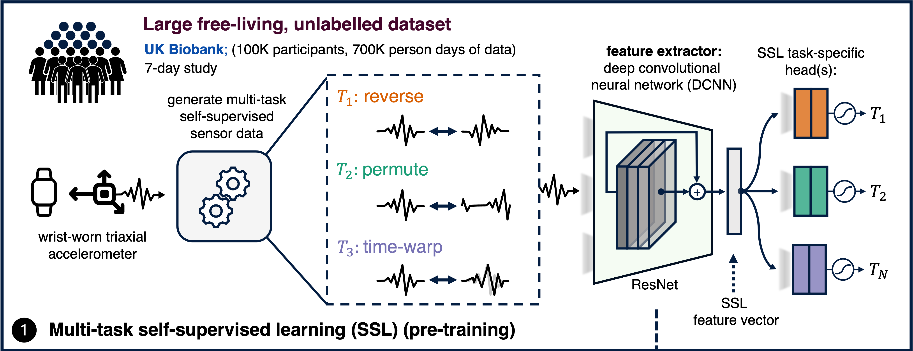
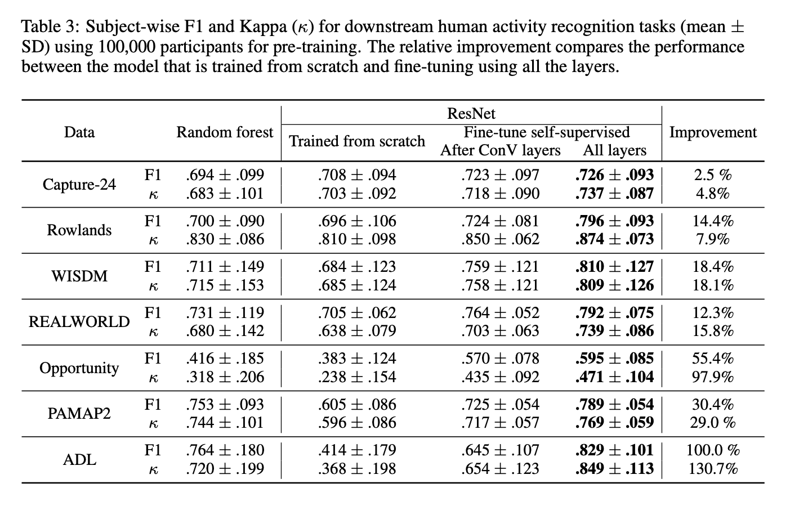
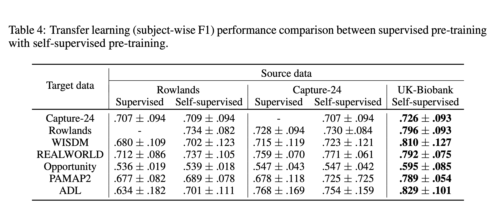
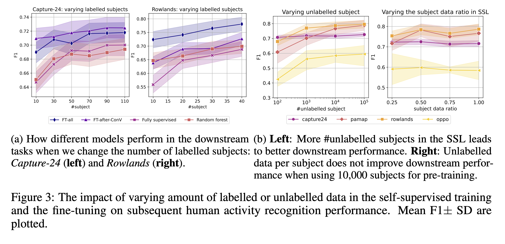
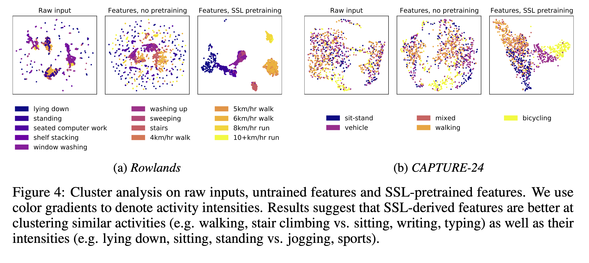

<!------------------------------------------ Hyperlinks ---------------------------------------------------->
<!--- If you want to update links for your code/paper/demo, modify that in _includes/page-header.html   -->
<!------------------------------------- End of hyperlinks -------------------------------------------------->


<!---------------------------------------------------------------------------------------------------------->
<!----------------------------------------- Abstract ------------------------------------------------------->
<hr>
  <p style="text-align: center;">Abstract</p>

  <p>
    Advances in deep learning for human activity recognition have been relatively limited due to the lack of large labelled datasets. 
    In this study, we leverage self-supervised learning techniques on the UK-Biobank activity tracker dataset--the largest of 
    its kind to date--containing more than 700,000 person-days of unlabelled wearable sensor data. Our resulting activity 
    recognition model consistently outperformed strong baselines across seven benchmark datasets, with an F1 relative improvement 
    of 2.5%-100% (median 18.4%), the largest improvements occurring in the smaller datasets. In contrast to previous studies, 
    our results generalise across external datasets, devices, and environments. Our open-source model will help researchers and developers 
    to build customisable and generalisable activity classifiers with high performance.

  </p>
<hr>

<!--------------------------------------- End abstract ----------------------------------------------------->
<!---------------------------------------------------------------------------------------------------------->


<!---------------------------------------------------------------------------------------------------------->
<!------------------------------------------ Main body ------------------------------------------------------>
# Summary
**We developed a foundation model for human activity recognition (HAR) using self-supervision. The pre-trained model is available to build high-performance human activity classifiers using accelerometer data.**


`harnet10` takes data that is 10-second long windows with 30hz of frequency. `harnet30` for 30-second long windows will be avaliable at
a later date.


We used self-supervision to train a ResNet16 V2 with 1D convolution. We inverted (arrow of the time), permuted, and time-warped the accelerometer data.




## Using the pre-trained model
```python
import torch
import numpy as np

repo = 'OxWearables/ssl-wearables'
harnet10 = torch.hub.load(repo, 'harnet10', class_num=5, pretrained=True)

x = np.random.rand(1, 3, 300)
x = torch.FloatTensor(x)
harnet10(x)
```

# Results

### The pre-trained model can consistenly improve activity classification performance



### Self-supervised pre-training out-performs supervised pre-training



### Pre-trained models achieves high performance even with limited labelled datasets



### The learnt features can discriminate activity intensities and frequencies without fine-tuning



## Bibliography

```tex
@misc{yuan2022selfsupervised,
      title={Self-supervised Learning for Human Activity Recognition Using 700,000 Person-days of Wearable Data}, 
      author={Hang Yuan and Shing Chan and Andrew P. Creagh and Catherine Tong and David A. Clifton and Aiden Doherty},
      year={2022},
      eprint={2206.02909},
      archivePrefix={arXiv},
      primaryClass={eess.SP}
}
```


## Acknowledgement


> We would like to thank all the helpful discussions and feedback we recevied from Aidan Acquah, Gert Mertes, Henrique Aguiar, Andres Tamm, and Korsuk Sirinukunwattana.
>This research has been conducted using the UK Biobank Resource under Application Number 59070. This work is supported by: Novo Nordisk (HY, AD); the Wellcome Trust [223100/Z/21/Z] (AD); GlaxoSmithKline (AC, DC); the British Heart Foundation Centre of Research Excellence [RE/18/3/34214] (AD); the National Institute for Health Research (NIHR) Oxford Biomedical Research Centre (AD, DC); and Health Data Research UK, an initiative funded by UK Research and Innovation, Department of Health and Social Care (England) and the devolved administrations, and leading medical research charities. It is also supported by the UK’s Engineering and Physical Sciences Research Council (EPSRC) with grants EP/S001530/1 (the MOA project) and EP/R018677/1 (the OPERA project); and the European Research Council (ERC) via the REDIAL project (Grant Agreement ID: 805194), and industrial funding from Samsung AI.
> We would also like to thank Alex Rowlands and Mike Catt, who kindly shared their activity dataset with us. Their project was funded by a grant from Unilever Discover to the School of Sports and Health Sciences, University of Exeter.
